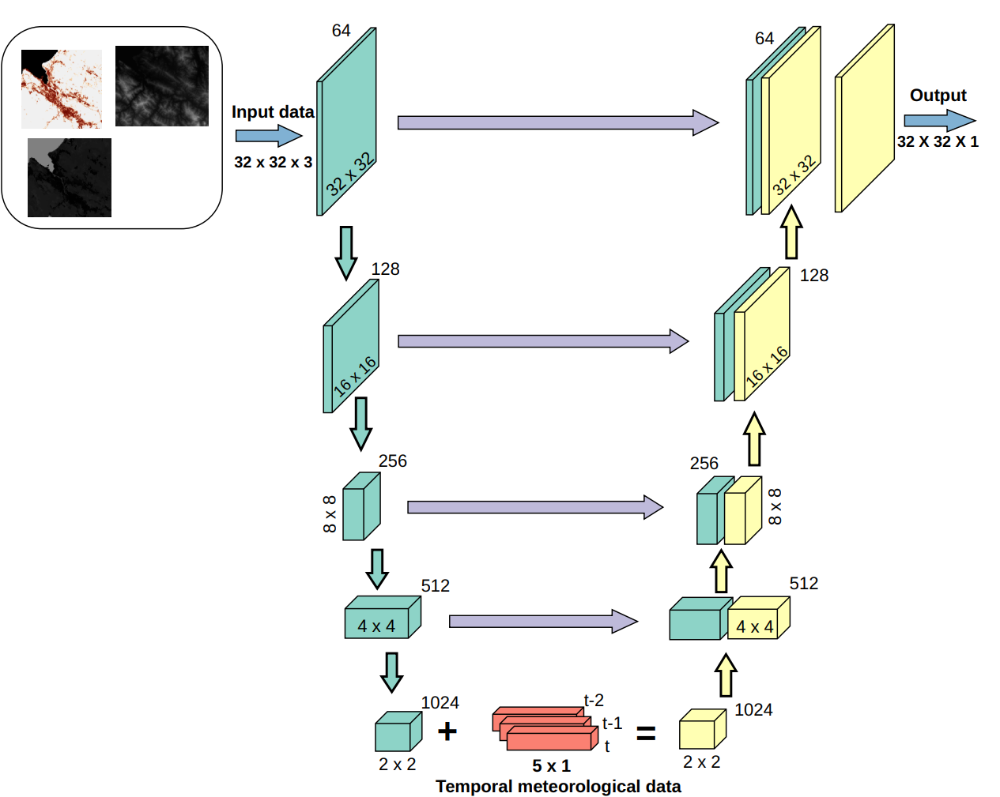
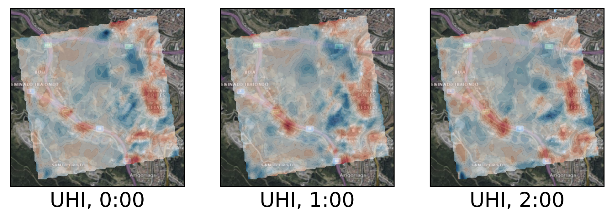
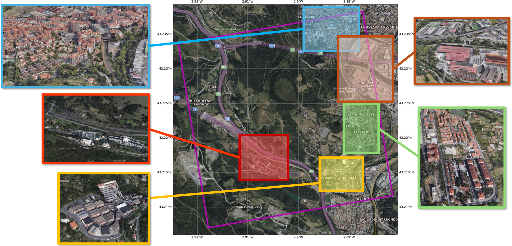

# A Machine Learning Approach for the Efficient Estimation of Ground-Level Air Temperature in Urban Areas
Repository containing the scripts and results of the paper "A Machine Learning Approach for the Efficient Estimation of Ground-Level Air Temperature in Urban Areas"
<p align="center">

</p>



### How to run:

Scripts and results are given in the folders named as such. Other scripts (production of plots, computation of quality statistics, etc) can be provided on demand.

### Contributing

If you find a bug, create a GitHub issue, or even better, submit a pull request. Similarly, if you have questions, simply post them as GitHub issues.

### Citing this work:

*Iñigo Delgado-Enales, Joshua Lizundia-Loiola, Patricia Molina-Costa, Javier Del Ser, "A Machine Learning Approach for the Efficient Estimation of Ground-Level Air Temperature in Urban Areas", under review, 2024*

**Abstract**

The increasingly populated cities of the 21st Century face the challenge of being sustainable and resilient spaces for their inhabitants. However, climate change, among other problems, makes these objectives difficult to achieve. The Urban Heat Island (UHI) phenomenon that occurs in cities, increasing their thermal stress, is one of the stumbling blocks to achieve a more sustainable city. The ability to estimate temperatures with a high degree of accuracy allows for the identification of the highest priority areas in cities where urban improvements need to be made to reduce thermal discomfort. In this work we explore the usefulness of image-to-image deep neural networks (DNNs) for correlating spatial and meteorological variables of a urban area with street-level air temperature. The air temperature at street-level is estimated both spatially and temporally for a specific use case, and compared with existing, well-established numerical models. Based on the obtained results, deep neural networks are confirmed to be faster and less computationally expensive alternative for ground-level air temperature compared to numerical models. 

[[Link to the paper]](XXX)

```
@article{delgadoenales24journal,
  title={{A Machine Learning Approach for the Efficient Estimation of Ground-Level Air Temperature in Urban Areas}},
  author={Delgado-Enales, I\~nigo and Lizundia-Loiola, Joshua and Molina-Costa, Patricia and {Del Ser}, Javier},
  journal={Under Review},
  year={2024}
}
```

### Contact:

- Iñigo Delgado-Enales, inigodelgado22@gmail.com
- Javier Del Ser, javier.delser@tecnalia.com
- Patricia Molina-Costa, patricia.molina@tecnalia.com
